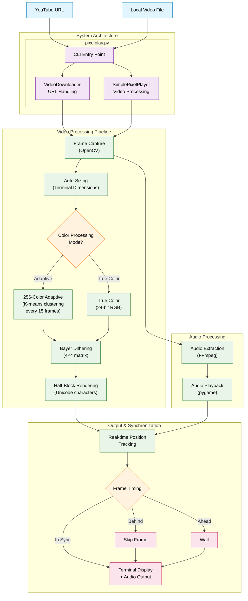

# Pixel Art Video Player

A terminal-based video player that transforms videos into high-quality pixel art using Unicode half-block characters and ANSI colors. It can download YouTube videos or play local video files directly in your terminal with synchronized audio playback.

## Installation

### Prerequisites
- Python 3.8 or higher
- Terminal with 24-bit color support (most modern terminals)
- FFmpeg installed on your system (for audio extraction)
- Sufficient terminal size (recommended: at least 120×60 characters)


## Usage

### Basic Commands

**Play a YouTube video:**
```bash
python pixelplay.py "https://www.youtube.com/watch?v=dQw4w9WgXcQ"
```

**Play a local video file:**
```bash
python pixelplay.py path/to/video.mp4
```

**Supported formats:** MP4, AVI, MOV, MKV, and any format supported by OpenCV

### Command Line Options

- `--true-color`: Use true 24-bit RGB colors instead of 256-color adaptive palette
- `--help` or `-h`: Show help message with all available options

### Controls
- **Ctrl+C**: Stop playback and exit
- The player automatically cleans up temporary files after playback


## Technical Details



## Dependencies

### Core Libraries
- **opencv-python** (≥4.8.0): Video processing and frame capture
- **numpy** (≥1.24.0): Numerical operations and array manipulation
- **pygame** (≥2.5.0): Audio playback
- **yt-dlp** (≥2024.1.0): YouTube video downloading

### Image Processing
- **Pillow** (≥10.0.0): Additional image operations
- **scipy** (≥1.11.0): KD-tree for color matching
- **scikit-image** (≥0.22.0): Advanced image processing
- **scikit-learn** (≥1.3.0): K-means clustering for adaptive palette generation

### Terminal UI
- **colorama** (≥0.4.6): Cross-platform terminal colors
- **blessed** (≥1.20.0): Terminal capabilities
- **click** (≥8.1.0): Command-line interface
- **tqdm** (≥4.66.0): Progress bars

### Performance
- **numba** (≥0.58.0): JIT compilation for critical loops

## Project Structure

```
pixel/
├── README.md                 # This documentation
├── pixelplay.py             # All-in-one video player with CLI
├── requirements.txt         # Python dependencies
└── venv/                    # Virtual environment (git-ignored)
```

## License

This project is provided as-is for educational and entertainment purposes. Please respect copyright laws when downloading and playing video content.
